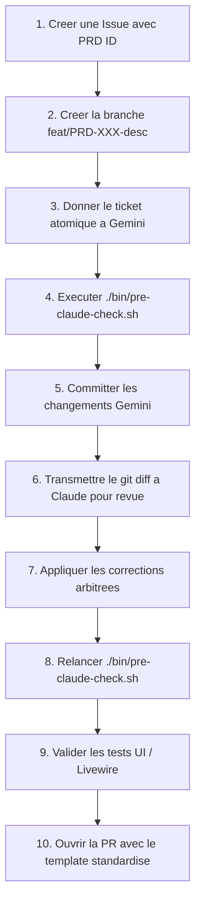

# Guide de Contribution — Cortex ERP AI-Native

Merci de votre interet pour contribuer au developpement de **Cortex**. Ce guide detaille notre cycle d'ingenierie et nos exigences de qualite logicielle.

---

## Le Cycle de Developpement Invariant (Gemini -> Claude)

Tout travail sur la base de code suit strictement le cycle en 10 etapes :



---

## Nomenclature des Branches

Toute branche doit obligatoirement respecter l'une des syntaxes suivantes :
- `feat/PRD-XXX-nom-de-la-fonctionnalite`
- `fix/PRD-XXX-description-du-correctif`
- `refactor/PRD-XXX-description`

### Identifiants PRD Disponibles :
- `PRD-ARCH` : Architecture API-first, policies communes, journal d'audit.
- `PRD-CON` : Consignation et commissions proprietaires.
- `PRD-INV` : Inventaire, verrous atomiques et disponibilite calendaire.
- `PRD-TRX` : Transactions de location et facturation.
- `PRD-CLI` : Gestion des clients et onboarding.
- `PRD-RET` : Retours d'equipements et check-in.
- `PRD-AI` : Agents Onyx et outils MCP.
- `PRD-MIG` : Migration et import de donnees legacy.
- `PRD-NFR` : Exigences non fonctionnelles, securite multi-tenant.

---

## 4 Invariants de Code Inviolables

1. **Isolation Multi-Tenant** : Toute requete Eloquent, job asynchrone, relation ou filtre doit etre scope par `company_id`.
2. **Journal d'Audit Append-Only** : Toute mutation d'etat metier doit emettre un evenement dans `audit_events`.
3. **Zero Hack Core** : Le domaine de location reside exclusivement dans `plugins/Webkul/CortexRental`.
4. **Validation Pre-Commit** : Le script `./bin/pre-claude-check.sh` doit etre 100% vert avant tout commit.

---

## Commandes de Validation Locale

```bash
# Verification globale automatique
./bin/pre-claude-check.sh

# Execution ciblee des tests Pest
./apps/cortex-core/vendor/bin/pest

# Analyse statique PHPStan
./apps/cortex-core/vendor/bin/phpstan analyse

# Formatage du code (Laravel Pint)
./apps/cortex-core/vendor/bin/pint
```
